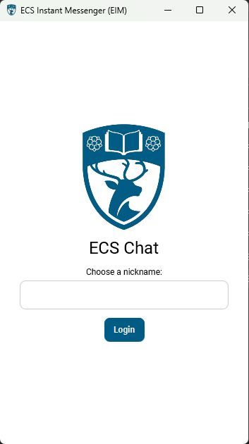
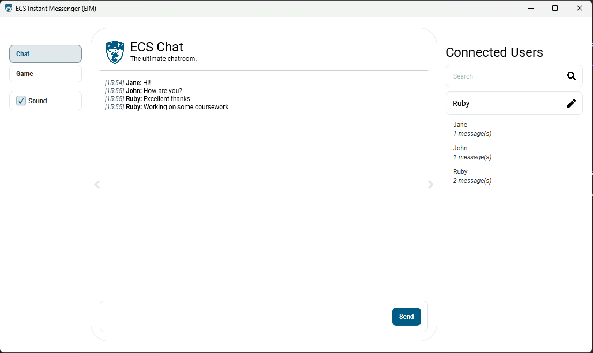
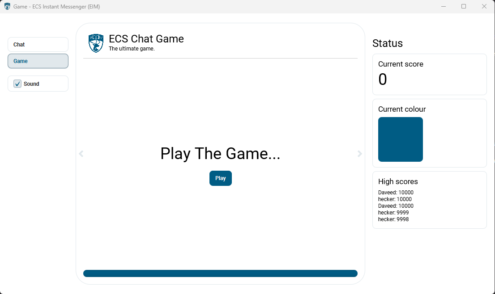
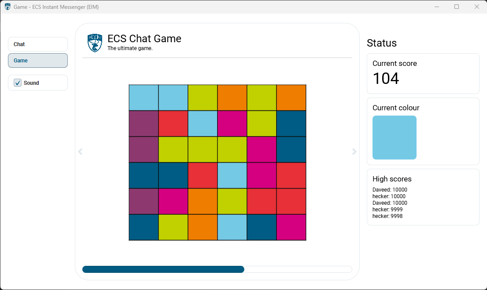

# ECS Chat

Chat application with built-in game built as part of COMP1206 at the University of Southampton.

This application is a Maven JavaFX project with a modern interface and compatability with multiple platforms.

## Showcase

## Credits

Thanks goes to Oli Bills for building the backend system and template for this software.

The University of Southampton logo is owned by the University of Southampton.